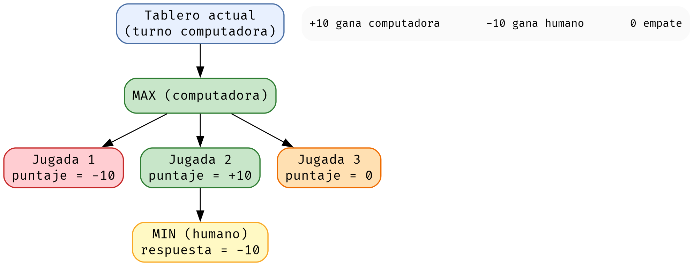
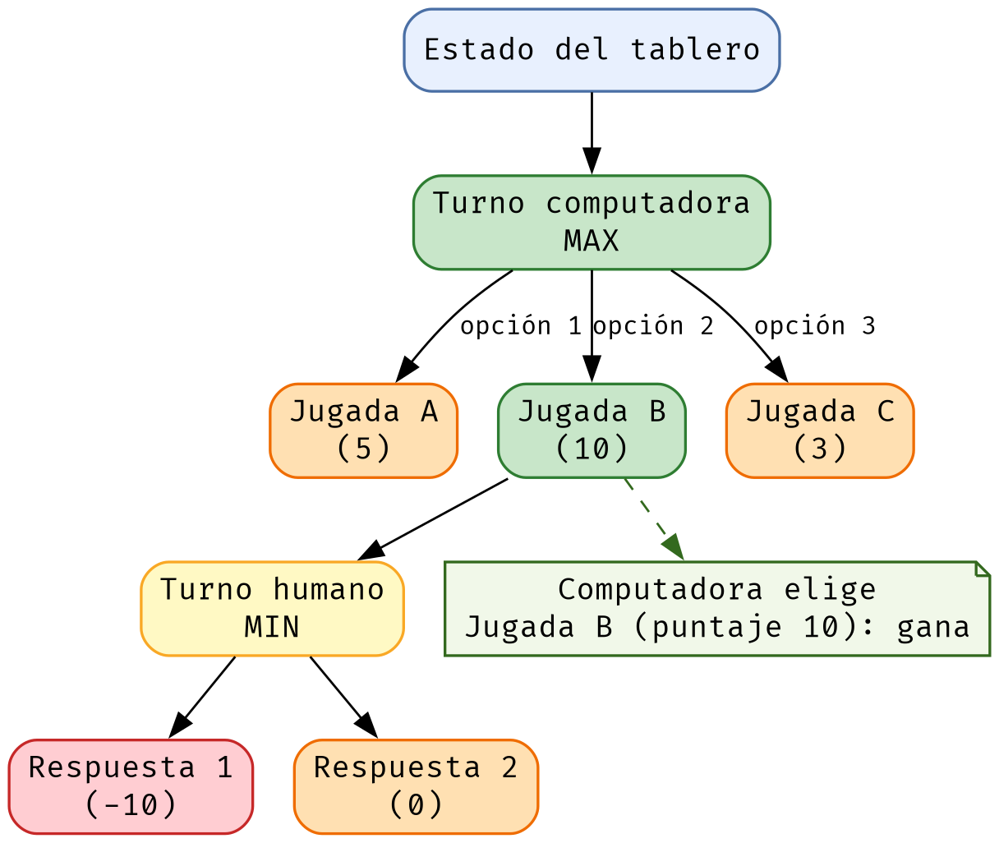
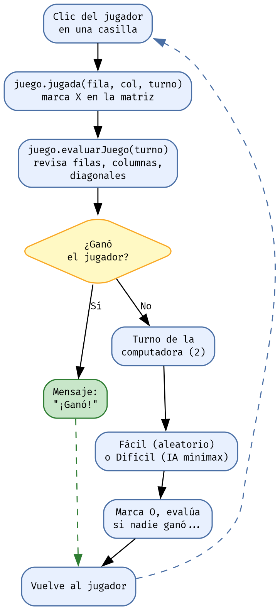

# Introducción — Para quién es este libro y cómo usarlo

¿Alguna vez quisiste crear tu propio videojuego pero sentiste que la programación era demasiado difícil? Este libro demuestra lo contrario: con una idea sencilla, un juego clásico como el Triki (tres en raya), y un lenguaje ordenado como Java, puedes construir desde cero un programa con ventanas, botones, colores y hasta una inteligencia artificial que piensa sus jugadas.

El gancho es simple: "Pasa de no saber nada de programación a construir tu primer juego con interfaz gráfica e IA que piensa sus jugadas". No necesitas experiencia previa; solo ganas de aprender y mucha curiosidad.

Este manual está pensado para principiantes absolutos. Usamos un tono cercano y sencillo, explicamos cada concepto aplicado directamente al código del Triki, y al final de cada capítulo encontrarás un repaso con preguntas y respuestas, además de un reto de código para que practiques.

El libro está organizado en seis partes pensadas para aprender en orden. La Parte Cero te enseña las reglas del juego y te muestra una partida completa bajo el microscopio, para que entiendas qué vamos a construir desde el primer minuto. La Parte I te prepara el taller: instalas el entorno y ejecutas el Triki por primera vez. La Parte II cubre los fundamentos de la programación con Java. La Parte III te muestra cómo está construido el juego, empezando por el mapa del código. La Parte IV presenta las herramientas profesionales: la línea de comandos, Maven, Git y las pruebas unitarias. Cierra con un glosario y un apéndice de referencia rápida del código.

> 💡 **CONSEJO:** No te saltes la Parte I. Configurar bien el entorno (JDK, IDE y Maven) y ejecutar el juego temprano es el primer paso para que todo lo demás funcione sin frustraciones.

---

# Parte Cero — El juego, para todos

## Capítulo 1: Las reglas del Triki

Antes de escribir una sola línea de código hay que entender el juego que vamos a construir. El **Triki** (también llamado tres en raya, triqui o "tres en línea") es uno de los juegos más antiguos y simples del mundo. Y eso lo hace perfecto para aprender a programar: tiene reglas claras, pocas piezas y un ganador fácil de detectar.

El juego se desarrolla en un **tablero con 9 casillas** (3 filas y 3 columnas). Dos jugadores se turnan: el **jugador uno** marca con una **X** y el **jugador dos** marca con una **O**.

1. **Inicio:** el tablero comienza vacío y siempre empieza la X.
2. **Turnos alternados:** los jugadores juegan por turnos, colocando su marca en una casilla vacía cada vez.
3. **Ganar:** gana quien primero logre juntar **tres marcas iguales en línea**: en una fila, en una columna o en una diagonal.
4. **Empate:** si el tablero se llena y nadie logra tres en línea, la partida termina en empate.

En nuestro juego también permitimos tableros más grandes (por ejemplo 4x4 o 5x5), donde el objetivo es completar una línea de tantas marcas como casillas tiene el lado: en un tablero de 4, una línea de 4; en uno de 5, una línea de 5. Pero el clásico, el que usaremos casi siempre, es el de 3x3. Aquí tienes un ejemplo de una partida ganada por el jugador de las X:

| col 0 | col 1 | col 2 |
|-------|-------|-------|
| X     | O     | X     |
| X     | O     | X     |
| X     | O     | O     |

Las tres X de la primera columna forman un triki: gana el jugador uno.

> 💡 **CONSEJO:** Dentro de la computadora, las casillas se nombran con dos números: la **fila** (de arriba hacia abajo, empezando en 0) y la **columna** (de izquierda a derecha, empezando en 0). Así, la casilla central de un tablero 3x3 es la (1, 1). Esta misma notación la verás en todo el código del libro.

**REPASO DEL CAPÍTULO**

1. ¿Qué tamaño tiene el tablero clásico del Triki?
   a) 3x3. b) 5x5. c) 2x2.
   **Respuesta correcta: a**
2. ¿Qué se necesita para ganar?
   a) Llenar el tablero. b) Tres marcas iguales en línea. c) Jugar de último.
   **Respuesta correcta: b**
3. Si el tablero se llena y nadie ganó, el resultado es...
   a) Victoria. b) Derrota. c) Empate.
   **Respuesta correcta: c**

**🏆 RETO DE CÓDIGO:** Abre el juego del Triki (tu profesor te mostrará cómo en la próxima parte) y juega una partida contra la computadora en dificultad Fácil. Mientras juegas, anota con qué símbolo juega cada uno y qué hace falta para ganar. Compara lo que observaste con las reglas de este capítulo.

## Capítulo 2: Una partida bajo el microscopio

Ahora vamos a ver cómo se aplican las reglas del capítulo anterior en una partida real, jugada paso a paso. Imagina esta partida entre el jugador (X, siempre empieza) y la computadora (O). Llamaremos a cada casilla con su (fila, columna), empezando desde 0.

**Movimiento 1:** X juega en el centro (1, 1). Es la jugada más fuerte del Triki: se vuelve parte de dos diagonales y del cruce central.

**Movimiento 2:** la computadora juega una esquina, (2, 2).

**Movimiento 3:** X juega en (0, 1). Ahora X tiene dos casillas en la columna del medio: (0, 1) y (1, 1). Amenaza con completar el triki en (2, 1).

**Movimiento 4:** O, que en dificultad fácil juega al azar, no nota la amenaza y juega en (1, 0).

**Movimiento 5:** X completa la columna con (2, 1). ¡Tres X en línea! Termina la partida: gana el jugador.

El tablero quedó así:

|       | col 0 | col 1 | col 2 |
|-------|-------|-------|-------|
| fila 0 | (vacío) | X | (vacío) |
| fila 1 | O | X | (vacío) |
| fila 2 | (vacío) | X | O |

Nuestro programa detectará esa línea recorriendo la columna 1 casilla por casilla y contando las X. Fíjate en lo que pasó en cada jugada: cada decisión respondió a una pregunta simple. Esas mismas preguntas son las que el código del Triki aprenderá a contestar solo:

| Pregunta | Regla que aplica | Dónde lo verás en el código |
|----------|------------------|-----------------------------|
| ¿Puedo marcar esta casilla? | La casilla debe estar vacía. | `Tablero` verifica la matriz antes de jugar (Capítulo 19) |
| ¿Ya gané al marcar? | Tres marcas en fila, columna o diagonal. | `Juego.evaluarJuego` chequea filas, columnas y diagonales (Capítulo 20) |
| ¿A dónde le toca jugar a la máquina? | La IA simula jugadas por adelantado. | `IA.minimax` si es difícil; casilla al azar si es fácil (Capítulo 21) |
| ¿Terminó el juego o sigue? | Hay ganador o el tablero está lleno. | `Juego.isTableroLleno` y el estado de fin de juego (Capítulo 20) |
| ¿Qué muestra la pantalla? | El tablero, el mensaje y el puntaje. | `Tablero` conecta clics, lógica y mensajes (Capítulo 22) |

Ese es el ciclo invisible del juego: cada clic desencadena una pequeña cadena de decisiones. Cuando en la Parte III recorra cada archivo del código, verás estas mismas reglas convertidas en Java, línea por línea.

> 💡 **CONSEJO:** Aprender a programar un juego es, en esencia, traducir reglas del mundo real a instrucciones exactas. Si no entiendes las reglas del Triki, no podrás escribirlas en código. Por eso empezamos el libro con ellas.

**REPASO DEL CAPÍTULO**

1. ¿Qué es lo primero que ocurre en cada jugada?
   a) La computadora piensa. b) Se verifica que la casilla esté vacía. c) Suena una música.
   **Respuesta correcta: b**
2. ¿Quién empieza siempre la partida?
   a) La O. b) La X. c) El que llegue primero.
   **Respuesta correcta: b**
3. ¿Qué hará la clase IA del proyecto?
   a) Dibujar la ventana. b) Decidir la jugada de la máquina. c) Controlar los turnos del humano.
   **Respuesta correcta: b**

**🏆 RETO DE CÓDIGO:** Juega una partida contra la computadora y anota, movimiento por movimiento, qué casilla elegiste y por qué. Luego responde para cada jugada: ¿estaba vacía?, ¿formaba un triki?, ¿bloqueaba un triki de la máquina? Ese análisis es exactamente lo que hará nuestro programa por ti en la Parte III.

---

# Parte I — Prepara el taller

## Capítulo 3: Configuración del Entorno de Desarrollo (paso a paso)

Antes de escribir código necesitamos preparar nuestra computadora. Piensa en esto como montar el taller antes de empezar a construir: si las herramientas están bien instaladas y configuradas, todo lo demás será mucho más fácil.

Necesitamos tres cosas: el **JDK** (Java Development Kit, que es el "kit de herramientas" para desarrollar en Java), un **editor o IDE** (el lugar donde escribimos el código) y **Git** (para descargar el proyecto desde internet). Empecemos.

### Paso 1: Instalar el JDK

El JDK es necesario porque incluye el compilador (`javac`) y la máquina virtual de Java (JVM). Lo descargamos desde el sitio oficial de Oracle o desde Adoptium (OpenJDK), que es gratuito.

Cuando ejecutes el instalador, acepta los términos y sigue los pasos: en Windows, marca la opción de agregar Java a la ruta del sistema (PATH) cuando el instalador lo ofrezca, ya que esto simplifica el uso desde la terminal.

Después de instalar, configura la variable de entorno `JAVA_HOME`. Esta variable le indica a las herramientas (como Maven) dónde está instalado Java. En Windows, busca "Editar las variables de entorno del sistema" y agrega `JAVA_HOME` apuntando a la carpeta de instalación (ej: `C:\Program Files\Java\jdk-17`). En Linux, se configura en el archivo de perfil del shell.

```bash
# Linux / macOS - agregar al final de ~/.bashrc o ~/.zshrc
export JAVA_HOME=/usr/lib/jvm/java-17-openjdk-amd64
export PATH=$JAVA_HOME/bin:$PATH
```

Para comprobar que todo quedó bien, abre una terminal nueva y escribe:

```bash
java -version
javac -version
```

> 💡 **CONSEJO:** Si ves la versión de Java al ejecutar `java -version`, la instalación fue exitosa. El `javac` es el compilador: su presencia confirma que el JDK (no solo el JRE) está instalado.

> ⚠️ **BUG ALERT - ERROR COMÚN:** `java` no se reconoce como un comando. Ocurre cuando `JAVA_HOME` o el PATH no están bien configurados. Revisa la variable de entorno y reinicia la terminal.

### Paso 2: Instalar un IDE (VS Code o IntelliJ IDEA)

Un IDE (Entorno de Desarrollo Integrado) es el editor donde escribirás y ejecutarás tu código. Tienes dos buenas opciones gratuitas: **VS Code** (ligero y extensible) e **IntelliJ IDEA Community** (potente, muy usado en empresas). Descarga e instala el que prefieras.

En VS Code instala la extensión "Extension Pack for Java" para obtener soporte completo de Java. En IntelliJ, el soporte de Java ya viene incluido: solo abre el proyecto y listo.

> 💡 **CONSEJO:** No necesitas memorizar un IDE: ambos hacen lo mismo (editar, compilar y ejecutar). Elige el que te resulte más cómodo; el conocimiento del código Java es lo que realmente importa.

### Paso 3: Clonar el repositorio del Triki

El código fuente del Triki está publicado en GitHub. Para descargarlo, abre una terminal, navega a la carpeta donde quieres el proyecto y escribe:

```bash
git clone https://github.com/carobayod/Triqui.git
cd Triqui
```

Esto creará una carpeta llamada `Triqui` con todo el código. El repositorio contiene las carpetas `src/main/java` (el código fuente) y `src/test/java` (las pruebas unitarias).

### Paso 4: Ejecutar el proyecto con Maven

Con Maven instalado y configurado, abrir el juego es tan sencillo como escribir un comando. Desde la carpeta del proyecto ejecuta:

```bash
mvn compile exec:java
```

Maven compilará el código y lanzará el juego. Se abrirá una ventana pidiéndote el tamaño del tablero (escribe 3 para un Triki clásico 3x3). ¡Ya estás jugando!

> ⚠️ **BUG ALERT - ERROR COMÚN:** `mvn` no se reconoce o "BUILD FAILURE". Revisa que Maven esté instalado y que `JAVA_HOME` apunte al JDK. Si el comando `mvn -version` no funciona, el problema está en la configuración de las variables de entorno, no en tu código.

**REPASO DEL CAPÍTULO**

1. ¿Qué incluye el JDK?
   a) Solo un editor. b) El compilador (javac) y la JVM. c) Un navegador.
   **Respuesta correcta: b**
2. ¿Para qué sirve la variable JAVA_HOME?
   a) Para guardar juegos. b) Para indicar dónde está instalado Java. c) Para conectarse a internet.
   **Respuesta correcta: b**
3. ¿Qué comando descarga el proyecto Triki desde GitHub?
   a) `git clone https://github.com/carobayod/Triqui.git` b) `mvn exec:java`. c) `java -version`.
   **Respuesta correcta: a**

**🏆 RETO DE CÓDIGO:** Investiga cómo instalar Java en tu sistema operativo específico (Windows, Linux o macOS) siguiendo los pasos de este capítulo, y deja funcionando `java -version` en tu terminal.

---

## Capítulo 4: Compilar y ejecutar el Triki

En el capítulo anterior dejaste el entorno listo y ejecutaste el juego con `mvn compile exec:java`. Ahora vamos a repetir esa ejecución, pero entendiendo qué ocurrió detrás de cada comando. Verás el viaje completo de tu código: de texto plano a la ventana del juego.

Cuando escribes código Java, la computadora no lo entiende en su idioma nativo. Primero hay que **compilarlo**: el programa `javac` traduce tus archivos `.java` a un lenguaje intermedio llamado bytecode (archivos `.class`). Después recién podemos **ejecutarlo** con `java`, que lee ese bytecode y lo pone en marcha. Para compilar todos los archivos del Triki de una vez y ejecutarlo, hacemos:

```bash
// Entrar a la carpeta donde están los archivos del proyecto
cd ruta/del/proyecto/Triqui/src/main/java

// Compilar todos los archivos .java
javac *.java

// Ejecutar el juego (se abre la ventana)
java Tablero
```

Cuando lo compiles, se generarán archivos `.class` (el bytecode) en la misma carpeta. El comando `java Tablero` abrirá la ventana del juego y te pedirá el tamaño del tablero: escribe 3 y ¡ya estás jugando! Nota que para ejecutar escribimos el nombre de la clase (`Tablero`), sin la extensión `.class` ni `.java`.

> ⚠️ **BUG ALERT - ERROR COMÚN:** `ClassNotFoundException` o `NoClassDefFoundError` al ejecutar `java`. Suele deberse a no estar en la carpeta correcta o a que el nombre de la clase no coincide con el nombre del archivo. Verifica que estés donde están los `.class` y que la clase se llame igual.

En la Parte IV verás cómo Maven automatiza todo esto en un solo comando, pero compilar a mano como hiciste ahora te enseña exactamente qué está pasando por debajo. Ese conocimiento es el que te hará entender los manuales y mensajes de error de verdad.

**REPASO DEL CAPÍTULO**

1. ¿Qué comando compila todos los archivos?
   a) java. b) javac \*.java. c) cd.
   **Respuesta correcta: b**
2. Después de compilar, ¿qué comando ejecuta el Triki?
   a) java Tablero. b) javac Tablero. c) run Tablero.
   **Respuesta correcta: a**
3. ¿Qué genera la compilación?
   a) Archivos .txt. b) Archivos .class (bytecode). c) Archivos .docx.
   **Respuesta correcta: b**

**🏆 RETO DE CÓDIGO:** Compila y ejecuta el Triki manualmente con `javac` y `java` (sin Maven), tal como se explica en este capítulo. Anota los pasos que seguiste y qué archivo `.class` se generó para cada clase.

---

# Parte II — Los fundamentos de la programación

## Capítulo 5: ¿Qué es programar?

Programar es darle instrucciones a una computadora para que haga lo que nosotros queremos. Piensa en una receta de cocina: la receta dice paso a paso qué hacer (cortar, mezclar, hornear) y la persona sigue esas instrucciones para obtener el plato final. Algo parecido pasa con un programa: es una lista ordenada de instrucciones que la computadora ejecuta paso a paso para obtener un resultado.

La computadora no piensa sola: hace exactamente lo que le decimos y en el orden que se lo decimos. Por eso es tan importante escribir instrucciones precisas y sin ambigüedades. Si una instrucción está mal, el resultado será incorrecto. A esto se le llama un "error" o "bug".

En este manual vamos a programar un juego de Triki (tres en raya). Aprenderás a programar jugando: verás cada concepto de programación aplicado en el código de nuestro juego.

**REPASO DEL CAPÍTULO**

1. ¿Programar es...?
   a) Hacer dibujos en la computadora. b) Dar instrucciones a la computadora. c) Jugar videojuegos.
   **Respuesta correcta: b**
2. ¿Qué hace la computadora con las instrucciones?
   a) Las interpreta y las ejecuta. b) Las ignora. c) Las inventa.
   **Respuesta correcta: a**
3. ¿A qué se le llama un "bug"?
   a) A un insecto real. b) A un error en el programa. c) A un comando especial.
   **Respuesta correcta: b**

**🏆 RETO DE CÓDIGO:** Escribe un pequeño programa que imprima 'Hola, soy Java' usando System.out.println, luego compílalo con `javac` y ejecútalo con `java` para ver el resultado en la terminal.

## Capítulo 6: ¿Qué es Java y por qué usarlo?

Java es uno de los lenguajes de programación más usados del mundo. Existen muchísimos lenguajes, pero Java es ideal para empezar porque es ordenado, poderoso y funciona en casi cualquier computadora.

Lo más importante de Java es la **Máquina Virtual de Java** (JVM, por sus siglas en inglés). La JVM es un programa especial que toma nuestro código y lo ejecuta. Gracias a ella, un programa escrito una sola vez puede correr en Windows, Linux o Mac sin cambios. Por eso Java tiene el lema: "Escríbelo una vez, ejecútalo en cualquier lugar".

Además, Java es un lenguaje "orientado a objetos". Esto significa que organizamos el programa en pequeñas piezas llamadas "objetos" que representan cosas del día a día. En nuestro Triki, tendremos un objeto `Juego` que sabe cómo jugar, y un objeto `Tablero` que dibuja la pantalla.

**REPASO DEL CAPÍTULO**

1. ¿Qué es la JVM?
   a) Un lenguaje de programación. b) La máquina virtual que ejecuta Java. c) Un virus.
   **Respuesta correcta: b**
2. ¿Qué significa "orientado a objetos"?
   a) Organizar el código en piezas llamadas objetos. b) Dibujar objetos. c) Usar computadoras.
   **Respuesta correcta: a**
3. Ventaja de Java: puede ejecutarse en...
   a) Solo Windows. b) Windows, Linux y Mac. c) Solo teléfonos.
   **Respuesta correcta: b**

**🏆 RETO DE CÓDIGO:** Investiga qué otros lenguajes de programación existen (por ejemplo Python, C++, JavaScript) y anota una ventaja de cada uno. Reflexiona: ¿por qué crees que Java se usa tanto en el mundo real?

## Capítulo 7: El ciclo de vida de un programa Java

Un programa Java pasa por varias etapas entre que escribimos el código y que la computadora lo ejecuta:

1. **Escritura:** creamos un archivo de texto con extensión `.java`, donde escribimos el código.
2. **Compilación:** un programa llamado "compilador" (`javac`) revisa nuestro código y lo traduce a un lenguaje intermedio llamado "bytecode". Si hay errores de sintaxis, aquí saldrán.
3. **Ejecución:** la JVM (el comando `java`) lee el bytecode y lo ejecuta en la computadora.

Para el Triki, los archivos `.java` son: `Juego.java` (la lógica), `Tablero.java` (la ventana), `IA.java` (la inteligencia) y `PosMatris.java` (una pieza que guarda una posición del tablero).

```java
// 1. Escribimos el codigo en un archivo .java
public class Hola {
    public static void main(String[] args) {
        System.out.println("Hola Triki");
    }
}
// 2. Compilamos:  javac Hola.java
// 3. Ejecutamos:   java Hola
```

**REPASO DEL CAPÍTULO**

1. ¿Qué archivo creamos al escribir código Java?
   a) Un .txt. b) Un .java. c) Un .exe.
   **Respuesta correcta: b**
2. ¿Qué hace el compilador (javac)?
   a) Ejecuta el programa. b) Traduce el código a bytecode. c) Borra archivos.
   **Respuesta correcta: b**
3. ¿Qué comando ejecuta el programa?
   a) `javac`. b) `java`. c) `cd`.
   **Respuesta correcta: b**

**🏆 RETO DE CÓDIGO:** Crea un archivo `Hola.java` que imprima tu nombre. Compílalo con `javac Hola.java` y ejecútalo con `java Hola`. Observa si se genera un archivo `Hola.class` (ese es el bytecode).

## Capítulo 8: Palabras básicas de Java

Antes de entender un programa, necesitas conocer algunas palabras que Java usa de forma especial (son las "palabras reservadas"). Estas son las más importantes para nuestro Triki:

| Palabra | ¿Qué significa? |
|---------|-----------------|
| `public` | Significa "público". Indica que algo se puede acceder desde cualquier parte. |
| `class` | Sirve para crear una "clase", que es como la plantilla de un objeto. Ej: `class Juego`. |
| `static` | Permite que un método se use sin necesidad de crear un objeto. |
| `void` | Indica que un método **NO** devuelve ningún valor. |
| `int` | Tipo de dato: números enteros (sin decimales). Ej: 3, 7, -2. |
| `boolean` | Tipo de dato: verdadero o falso (true o false). |
| `String` | Tipo de dato: texto. Ej: "Hola". |
| `true / false` | Los dos valores que puede tener un boolean. |
| `null` | Significa "vacío" o "sin valor". |
| `if / else` | Estructura condicional: si la condición se cumple, haz esto; si no, haz lo otro. |
| `for / while` | Estructuras para repetir instrucciones (bucles). |
| `return` | Devuelve un valor desde un método. |

En nuestro `Juego.java` verás palabras como `int`, `boolean`, `public`, `private`, `for` y `return`. Iremos señalando cada una cuando aparezca.

**REPASO DEL CAPÍTULO**

1. ¿Qué tipo de dato guarda "Hola"?
   a) int. b) boolean. c) String.
   **Respuesta correcta: c**
2. ¿Cuántos valores puede tener un boolean?
   a) 10. b) 2 (true o false). c) 3.
   **Respuesta correcta: b**
3. La palabra 'void' significa que el método...
   a) Devuelve un número. b) No devuelve nada. c) Se repite.
   **Respuesta correcta: b**

**🏆 RETO DE CÓDIGO:** En el archivo `Juego.java` del proyecto Triki, identifica al menos 5 palabras reservadas distintas (como int, boolean, public, private, for, return) y escribe en qué línea aparecen.

## Capítulo 9: Variables y tipos de datos

Una variable es un espacio en la memoria de la computadora donde guardamos un valor. Es como una caja con una etiqueta: la etiqueta es el nombre de la variable y dentro ponemos el valor.

Antes de usar una variable en Java debemos declararla (crearla) y decirle su tipo. Los tipos que más usaremos son:

1. `int` — números enteros. Ejemplo: `int iTurno = 1;`
2. `boolean` — verdadero o falso. Ejemplo: `boolean bFinJuego = false;`
3. `String` — texto. Ejemplo: `String nombre = "Triki";`
4. `char` — un solo carácter. Ejemplo: `char letra = 'X';` (lo veremos de pasada)

En nuestro juego necesitamos recordar el estado del tablero. Para eso usamos una matriz (un arreglo de dos dimensiones): un cuadro de 3x3 que guarda números. Por convención, en el Triki: 0 = casilla vacía, 1 = jugador marcó X, 2 = computadora marcó O.

```java
// En Juego.java
private int mJuego[][];
private boolean bFinJuego = false;
private int iTamanio;
private int iTurno = 1;

// Guardar una jugada: la casilla (fila,columna) queda con el turno
public void jugada(int fila, int columna, int turno) {
    this.mJuego[fila][columna] = turno;
}
```

**REPASO DEL CAPÍTULO**

1. ¿Qué es una variable?
   a) Un valor fijo. b) Un espacio de memoria con nombre. c) Un comando.
   **Respuesta correcta: b**
2. La declaración 'int x = 5;' guarda...
   a) Un texto. b) El número 5. c) Un carácter.
   **Respuesta correcta: b**
3. En el Triki, ¿qué significa que una casilla tenga valor 0?
   a) Está vacía. b) La marcó el jugador. c) La marcó la máquina.
   **Respuesta correcta: a**

**🏆 RETO DE CÓDIGO:** Declara variables de los cuatro tipos (int, boolean, String, char) para representar: el tamaño del tablero, si el juego terminó, el mensaje de bienvenida y la letra que marca al jugador. Asigna un valor inicial a cada una.

## Capítulo 10: Estructuras condicionales

Las estructuras condicionales permiten que el programa tome decisiones. La más usada es `if` (si), que se escribe así:

```java
if (condicion) {
    // Esto se ejecuta SOLO si la condicion es verdadera
} else {
    // Esto se ejecuta SOLO si la condicion es falsa
}
```

En el Triki usamos condiciones para muchas cosas. Por ejemplo, antes de marcar una casilla, verificamos que esté vacía; y después de cada jugada, verificamos si alguien ganó:

```java
// En Tablero.java - antes de jugar, la casilla debe estar vacia
if (juego.getmJuego()[fila][columna] != 0) break;

// Verificar si el jugador gano
if (juego.isbFinJuego()) {
    lMensaje.setText("Gano el jugador!");
    deshabilitarTablero();
    return;
}
```

Otra condición importante: preguntamos quién es el turno para saber si se coloca X y juega la persona, o si se coloca O y juega la computadora.

```java
if (juego.getiTurno() == 1) {
    mBotones[fila][columna].setText("X"); // juega el humano
} else {
    mBotones[fila][columna].setText("O"); // juega la maquina
}
```

> ⚠️ **BUG ALERT - ERROR COMÚN:** Confundir `=` con `==`. `=` asigna un valor (`int x = 5;`) y `==` compara dos valores (`if (x == 5)`). Usar el equivocado es uno de los errores más comunes y difíciles de ver.

**REPASO DEL CAPÍTULO**

1. ¿Para qué sirve la estructura 'if'?
   a) Para repetir código. b) Para tomar decisiones. c) Para guardar variables.
   **Respuesta correcta: b**
2. En 'if (x == 1)', ¿qué significa '=='?
   a) Asignar un valor. b) Comparar si son iguales. c) Sumar.
   **Respuesta correcta: b**
3. 'else' se ejecuta cuando...
   a) La condición es verdadera. b) La condición es falsa. c) Nunca.
   **Respuesta correcta: b**

**🏆 RETO DE CÓDIGO:** Escribe la estructura if/else que use el Triki para saber si la casilla está vacía antes de marcarla. Pista: usa `juego.getmJuego()[fila][columna] != 0` como condición.

## Capítulo 11: Ciclos (bucles)

Los ciclos permiten repetir una acción varias veces. En programación es muy común querer recorrer todos los elementos de una lista o de un tablero. Para eso usamos `for` y `while`.

El ciclo `for` se usa cuando sabemos cuántas veces repetir. Por ejemplo, para recorrer una matriz de 3x3 necesitamos dos ciclos anidados: uno para las filas y otro para las columnas.

```java
// Recorrer cada casilla del tablero
for (int fila = 0; fila < iTamanio; fila++) {
    for (int columna = 0; columna < iTamanio; columna++) {
        // aqui trabajamos con la casilla (fila, columna)
    }
}
```

En `Juego.java` usamos ciclos para verificar si hay un triki en las filas, columnas y diagonales. Por ejemplo, para revisar si una fila está llena con las marcas de un mismo jugador:

```java
// En evaluarFilas: contar cuantas X u O hay en cada fila
int iTriky = 0;
for (int fila = 0; fila < iTamanio; fila++) {
    for (int columna = 0; columna < iTamanio; columna++) {
        if (mJuego[fila][columna] == iTurno) {
            iTriky++;
        }
    }
    if (iTriky == iTamanio) {
        bFinJuego = true;
    }
    iTriky = 0;
}
```

> 💡 **CONSEJO:** Los ciclos `for` anidados son perfectos para recorrer matrices. La clave es: ciclo externo = filas, ciclo interno = columnas. Este patrón aparece muchísimo en marcos, juegos y datos tabulares.

**REPASO DEL CAPÍTULO**

1. ¿Para qué sirve un ciclo 'for'?
   a) Para tomar decisiones. b) Para repetir instrucciones. c) Para declarar variables.
   **Respuesta correcta: b**
2. 'fila++' significa...
   a) Incrementar fila en 1. b) Disminuir fila en 1. c) Poner fila en 0.
   **Respuesta correcta: a**
3. ¿Qué pareja de ciclos necesitamos para recorrer una matriz 3x3?
   a) Uno. b) Dos anidados (filas y columnas). c) Tres.
   **Respuesta correcta: b**

**🏆 RETO DE CÓDIGO:** Escribe un ciclo `for` que recorra el tablero completo y cuente cuántas casillas vacías (valor 0) hay. Este será la base de tu propio método `isTableroLleno`.

## Capítulo 12: Métodos y funciones

Un método (también llamado función) es un bloque de código con un nombre, que podemos llamar (invocar) cuando lo necesitemos. Es como una pequeña "sub-receta" dentro de la receta principal.

Los métodos tienen dos grandes ventajas: evitan repetir código (si necesitas hacer algo varias veces, lo escribes una sola vez como método) y organizan el programa en partes claras.

Un método puede recibir "parámetros" (los datos que necesita para trabajar) y puede "devolver" (return) un resultado. Veamos la estructura:

```java
// Estructura de un metodo
tipoDevolver nombreMetodo(tipoParametro parametro1, ...) {
    // cuerpo del metodo
    return valor; // si no devuelve nada, usamos void
}
```

En `Juego.java` tenemos varios métodos. Por ejemplo, `jugada` marca una casilla y no devuelve nada (void); `isTableroLleno` devuelve un boolean (true o false); y `jugadaMaquinaInteligente` devuelve la posición escogida por la IA.

```java
// Metodo que devuelve si el tablero esta lleno (true) o no (false)
public boolean isTableroLleno() {
    for (int fila = 0; fila < iTamanio; fila++) {
        for (int columna = 0; columna < iTamanio; columna++) {
            if (mJuego[fila][columna] == 0) {
                return false; // encontramos una vacia
            }
        }
    }
    return true; // no hay vacias
}
```

**REPASO DEL CAPÍTULO**

1. ¿Qué es un método?
   a) Un tipo de variable. b) Un bloque de código reutilizable con nombre. c) Un ciclo.
   **Respuesta correcta: b**
2. ¿Qué significan los parámetros de un método?
   a) Los valores que devuelve. b) Los datos que recibe para trabajar. c) El nombre del método.
   **Respuesta correcta: b**
3. Si un método usa 'void' en su declaración, significa que...
   a) Devuelve un número. b) No devuelve nada. c) Es un ciclo.
   **Respuesta correcta: b**

**🏆 RETO DE CÓDIGO:** Crea un método llamado `sumar` que reciba dos enteros y devuelva su suma usando `return`. Luego otro método `saludar` que no devuelva nada (void) e imprima 'Hola Triki'. Invoca ambos desde `main`.

## Capítulo 13: Encapsulamiento y Programación Orientada a Objetos

La Programación Orientada a Objetos (POO) organiza el código en "clases" (plantillas) y "objetos" (instancias). Una clase define un tipo de cosa, y de esa clase podemos crear muchos objetos.

Una clase es como un molde para hacer galletas: el molde (la clase) define la forma, y cada galleta que haces (el objeto) usa ese molde. En nuestro juego, la clase `Juego` es el molde, y cada partida que iniciamos es un objeto `Juego`.

El "encapsulamiento" es el principio de proteger los datos internos de una clase. Lo hacemos con `private` (privado) para los datos y `public` (público) para los métodos que permiten acceder a ellos de forma controlada. Así nadie puede tocar la matriz del tablero directamente y romper el juego.

```java
public class Juego {
    // privado: nadie de afuera puede tocar la matriz directamente
    private int mJuego[][];

    // publico: un metodo para guardar una jugada de forma controlada
    public void jugada(int fila, int columna, int turno) {
        this.mJuego[fila][columna] = turno;
    }
}
```

Los "getters" y "setters" son métodos especiales: los getters (get...) sirven para LEER el valor de un dato privado, y los setters (set...) para MODIFICARLO. En el código del Triki verás muchos, como `getiTurno()`, `setiTurno()`, `isbFinJuego()`. El `is` en lugar de `get` se usa para booleanos.

```java
// Getters y setters en Juego.java
public int getiTurno() { return iTurno; }
public void setiTurno(int iTurno) { this.iTurno = iTurno; }

public boolean isbFinJuego() { return bFinJuego; }
public void setbFinJuego(boolean bFinJuego) { this.bFinJuego = bFinJuego; }
```

> 💡 **CONSEJO:** Regla de oro del encapsulamiento: los datos de una clase siempre privados (`private`) y el acceso solo por métodos públicos. Así nadie puede meter en la matriz del tablero un valor que no sea 0, 1 o 2.

**REPASO DEL CAPÍTULO**

1. ¿Qué es una clase?
   a) Un objeto ya creado. b) Una plantilla para crear objetos. c) Una variable.
   **Respuesta correcta: b**
2. ¿Qué hace 'private'?
   a) Permite acceder desde cualquier lugar. b) Protege los datos para que solo se accedan desde la clase. c) Es un tipo de dato.
   **Respuesta correcta: b**
3. Un getter sirve para...
   a) Modificar un dato. b) Leer un dato privado. c) Borrar un dato.
   **Respuesta correcta: b**

**🏆 RETO DE CÓDIGO:** En la clase `Juego`, convierte el campo `iTamanio` en privado y agrega su getter y setter, igual que ya existe `getiTurno()` y `setiTurno()`. ¿Por qué crees que es buena práctica proteger ese dato?

# Parte III — Cómo está construido el Triki

## Capítulo 14: El mapa del código

En los capítulos anteriores aprendiste las reglas del Triki, preparaste tu computadora y ejecutaste el juego. Ahora vamos a abrir su "capucha" para ver cómo está construido por dentro. Este capítulo es el mapa del territorio: si entiendes dónde vive cada pieza, los capítulos siguientes serán fáciles de seguir.

El proyecto Triki es una carpeta con dos ramas importantes:

| Carpeta | Contenido |
|---------|-----------|
| `src/main/java` | El código del juego: 4 clases. |
| `src/test/java` | Las pruebas unitarias: 2 clases. |

Dentro de `src/main/java` encontramos cuatro clases que cumplen cuatro responsabilidades distintas:

| Clase | Responsabilidad | Analogía |
|-------|-----------------|----------|
| `Tablero.java` | La pantalla: crea la ventana, dibuja los botones y captura los clics. | El puesto del jugador: lo que ves y tocas. |
| `Juego.java` | La lógica: guarda el tablero en una matriz y decide si hay ganador o empate. | El árbitro: conoce las reglas. |
| `IA.java` | La inteligencia: calcula la mejor jugada con el algoritmo minimax. | El estratega: piensa las jugadas. |
| `PosMatris.java` | Un contenedor de datos que guarda una fila y una columna (la jugada elegida). | Una tarjeta con la posición escrita. |

Y en `src/test/java`:

| Clase | Qué prueba |
|-------|------------|
| `TestJuego.java` | Las reglas del juego (victorias, empates, tablero lleno). |
| `TestIA.java` | Que la inteligencia artificial elija la mejor jugada. |

Estas piezas encajan así: `Tablero` (la pantalla) le pide reglas a `Juego` (la lógica), y cuando le toca jugar a la máquina, `Juego` delega en `IA` para decidir dónde marcar. `PosMatris` es el mensaje que se pasan entre ellas: "juega en la fila tal, columna tal".

En los próximos capítulos recorreremos el mapa en orden: primero entendemos qué es una interfaz gráfica y sus componentes (capítulos 15 a 18), después caminamos por el código real de cada archivo (capítulos 19 a 21) y cerramos viendo cómo se conectan todas las piezas (capítulo 22). Al final del libro, el apéndice te servirá como referencia rápida de este mismo mapa.

> 💡 **CONSEJO:** Cuando un proyecto de código te parezca grande, empieza siempre por el mapa: ¿qué archivos hay y qué hace cada uno? Con esa vista general, cualquier archivo concreto deja de intimidar. Los programadores profesionales pasan mucho tiempo leyendo mapas de proyectos ajenos.

**REPASO DEL CAPÍTULO**

1. ¿Qué clase dibuja la ventana y los botones?
   a) Juego. b) Tablero. c) IA.
   **Respuesta correcta: b**
2. ¿Qué clase decide si hay un triki?
   a) Tablero. b) PosMatris. c) Juego.
   **Respuesta correcta: c**
3. ¿Para qué sirve `PosMatris`?
   a) Para guardar una fila y una columna. b) Para dibujar. c) Para compilar.
   **Respuesta correcta: a**

**🏆 RETO DE CÓDIGO:** Abre el proyecto del Triki (ya lo clonaste en el capítulo 3). Con la vista de archivos (VS Code o IntelliJ), localiza las 4 clases de `src/main/java` y las 2 de `src/test/java`. Toca cada archivo y lee solo los comentarios: ¿coinciden con las responsabilidades de este capítulo?

## Capítulo 15: ¿Qué es Swing y qué es una interfaz gráfica?

En el capítulo 4 ejecutaste el Triki y viste su ventana por primera vez: botones, colores y mensajes. Ahora vamos a entender cómo se construye esa ventana. Para eso usamos **Swing**, una librería que viene con Java para crear ventanas y botones (lo que se llama **GUI**).

Una **GUI** (por sus siglas en inglés) es lo que la persona ve y con lo que interactúa: ventanas, botones, cuadros de texto, menús. Swing nos da todos estos componentes listos para usar.

En nuestro Triki, la clase `Tablero` crea una ventana (JFrame) que contiene un cuadro de botones 3x3 (el tablero), mensajes, un puntaje y botones para reiniciar y elegir dificultad.

**REPASO DEL CAPÍTULO**

1. ¿Qué es Swing?
   a) Un juego. b) Una librería de Java para crear interfaces gráficas. c) Un tipo de variable.
   **Respuesta correcta: b**
2. ¿Qué significa GUI?
   a) Interfaz gráfica de usuario. b) Grupo de instrucciones. c) Grabar instrucciones útiles.
   **Respuesta correcta: a**
3. ¿Qué clase de nuestro juego crea la ventana?
   a) Juego. b) Tablero. c) IA.
   **Respuesta correcta: b**

**🏆 RETO DE CÓDIGO:** Abre la clase `Tablero.java` y lista los componentes Swing que ves (JFrame, JButton, JLabel...). Anota qué ventana y qué cuadro de botones forman la interfaz del juego.

## Capítulo 16: Componentes Swing del Triki

Swing nos ofrece componentes (piezas visuales) listas para usar. Estas son las que usamos en nuestro juego:

| Componente | Función en el Triki |
|------------|---------------------|
| `JFrame` | La ventana principal del juego. |
| `JButton` | Los botones del tablero (cada casilla es un botón). |
| `JLabel` | Textos informativos (mensaje del juego, puntaje). |
| `JPanel` | Contenedores donde agrupamos otros componentes. |
| `JComboBox` | El selector de dificultad (Fácil / Difícil). |
| `JOptionPane` | Cuadros de diálogo (como el que pide el tamaño del tablero). |

```java
// En Tablero.java
private JButton mBotones[][];   // matriz de botones (el tablero)
private JLabel lMensaje;        // mensaje del juego
private JLabel lPuntaje;        // puntaje
private JComboBox<String> cbDificultad; // selector de dificultad
```

> 💡 **CONSEJO:** Recuerda el patrón: JFrame (ventana) contiene JPanels (contenedores) que agrupan JButtons, JLabels y JComboBoxes. Agrupar paneles dentro de otros paneles es algo muy común en interfaces.

**REPASO DEL CAPÍTULO**

1. ¿Qué componente Swing representa la ventana?
   a) JButton. b) JFrame. c) JLabel.
   **Respuesta correcta: b**
2. ¿Qué componente es cada casilla del tablero?
   a) JLabel. b) JButton. c) JComboBox.
   **Respuesta correcta: b**
3. ¿Para qué sirve JOptionPane?
   a) Para dibujar el tablero. b) Para mostrar cuadros de diálogo. c) Para repetir código.
   **Respuesta correcta: b**

**🏆 RETO DE CÓDIGO:** Agrega un `JLabel` nuevo a la ventana del Triki que muestre el nombre del juego en la parte superior. Pista: agrégalo al panel `pSur` con `BorderLayout` para colocarlo en una posición.

## Capítulo 17: Distribución de los componentes (Layout)

Cuando colocamos varios componentes en una ventana, necesitamos decirle a Swing cómo distribuirlos. Para eso usamos los "layouts" (distribuciones). En el Triki usamos dos:

1. **GridLayout:** distribuye los componentes en una rejilla (grilla) de filas y columnas. Perfecto para el tablero: creamos un grid de 3 filas x 3 columnas y colocamos cada botón.
2. **BorderLayout:** divide la ventana en zonas (norte, sur, centro, este, oeste). Usamos el centro para el tablero y el sur para los mensajes, puntaje y botones.

```java
// Tablero: rejilla de N x N para los botones
pBotones = new JPanel();
pBotones.setLayout(new GridLayout(iTamanio, iTamanio));

// Ventana principal: centro = tablero, sur = controles
this.setLayout(new BorderLayout());
this.add(pBotones, BorderLayout.CENTER);
this.add(pSur, BorderLayout.SOUTH);
```

> 💡 **CONSEJO:** Cuando un componente no aparece donde esperas, casi siempre es por el layout o por el orden en que lo agregas. Cambia `BorderLayout.CENTER` por `NORTH` o `SOUTH` y verás cómo se mueve: experimentar con los layouts es la mejor forma de dominarlos.

**REPASO DEL CAPÍTULO**

1. ¿Qué layout sirve para la rejilla del tablero?
   a) BorderLayout. b) GridLayout. c) FlowLayout.
   **Respuesta correcta: b**
2. En BorderLayout, 'BorderLayout.SOUTH' coloca el componente...
   a) En el centro. b) Abajo. c) Arriba.
   **Respuesta correcta: b**
3. ¿Dónde colocamos el tablero de botones en la ventana?
   a) En el centro. b) Abajo. c) A la izquierda.
   **Respuesta correcta: a**

**🏆 RETO DE CÓDIGO:** Cambia la posición del tablero para que quede abajo (BorderLayout.SOUTH) y los controles arriba (BorderLayout.NORTH). Observa cómo cambia la apariencia de la ventana.

## Capítulo 18: Los eventos: cómo reacciona el programa al clic

Hasta ahora el programa ejecuta instrucciones en orden. Pero en una interfaz gráfica, el programa debe reaccionar a las acciones del usuario, como hacer clic en un botón. A esto se le llama "manejo de eventos".

Para que un botón responda a los clics, le registramos un "escuchador" (listener) usando `addActionListener(this)`. Esto le dice a Swing: "cuando alguien haga clic, avísame". Luego, la clase implementa la interfaz `ActionListener` y define el método `actionPerformed`, que se ejecuta cuando ocurre un clic.

```java
// Tablero implementa ActionListener para escuchar los clics
public class Tablero extends JFrame implements ActionListener {
    ...
    @Override
    public void actionPerformed(ActionEvent e) {
        // aqui sabemos QUE boton se presiono y reaccionamos
        if (e.getSource().equals(bNuevoJuego)) {
            init(); // reiniciar el juego
            return;
        }
    }
}
```

Con `e.getSource()` averiguamos qué componente generó el evento, y así decidimos qué hacer. En `Tablero.java` recorremos la matriz de botones para saber en qué casilla se hizo clic.

> ⚠️ **BUG ALERT - ERROR COMÚN:** Error común en Swing: actualizar la interfaz desde un hilo que no es el de eventos. En el Triki el clic ya ocurre en el hilo de eventos, pero si haces cálculos largos (como minimax en tableros grandes) la ventana puede congelarse. Para eso se usan `SwingWorker` o `SwingUtilities.invokeLater`.

> 💡 **CONSEJO:** Esto es un patrón muy común en Swing: el botón "avisa" a la ventana cuando alguien hace clic, y la ventana reacciona. Los programadores lo llaman patrón Observer, y lo verás repetido en muchos programas de Java.

**REPASO DEL CAPÍTULO**

1. ¿Qué método se ejecuta cuando ocurre un clic?
   a) init. b) actionPerformed. c) setText.
   **Respuesta correcta: b**
2. ¿Para qué sirve 'addActionListener'?
   a) Para dibujar. b) Para registrar un escuchador de eventos. c) Para compilar.
   **Respuesta correcta: b**
3. ¿Qué hace 'e.getSource()'?
   a) Devuelve el componente que generó el evento. b) Borra la ventana. c) Cambia de turno.
   **Respuesta correcta: a**

**🏆 RETO DE CÓDIGO:** Agrega un segundo botón 'Salir' que cierre el programa. Pista: en `actionPerformed` verifica `e.getSource().equals(bSalir)` y llama a `System.exit(0)`.

## Capítulo 19: Recorrido del código de Tablero.java (la pantalla)

Ahora vamos a caminar por el código real de `Tablero.java` para ver todos los conceptos juntos. Esta clase se encarga de la interfaz: crea la ventana, los botones y reacciona a los clics.

El método `main` es el punto de entrada del programa. Pide al usuario el tamaño del tablero (por defecto 3x3) y crea la ventana:

```java
public static void main(String args[]) {
    // Pide el tamano (ej: 3 para 3x3)
    Integer iNumero = Integer.parseInt(
        JOptionPane.showInputDialog("Digite el tamano del triky (3x3, 4x4..)"));
    Tablero t = new Tablero(iNumero);
    t.setVisible(true); // mostrar la ventana
}
```

El constructor `Tablero(int iTamanio)` crea todos los componentes: la matriz de botones, los labels, el selector de dificultad y el botón de nuevo juego. Crea un ciclo anidado para generar los botones de la rejilla:

```java
mBotones = new JButton[iTamanio][iTamanio];
for (int fila = 0; fila < iTamanio; fila++) {
    for (int columna = 0; columna < iTamanio; columna++) {
        mBotones[fila][columna] = new JButton();
        mBotones[fila][columna].setFont(new Font("Arial", Font.BOLD, 48));
        pBotones.add(mBotones[fila][columna]);
        mBotones[fila][columna].addActionListener(this);
    }
}
```

El método `actionPerformed` reacciona a los clics. Cuando el jugador presiona una casilla vacía, se llama a `juego.jugada(...)` para marcarla, luego a `juego.evaluarJuego(...)` para revisar si hay ganador, y después se actualiza el texto del botón con X o O.

**REPASO DEL CAPÍTULO**

1. ¿Cuál es el punto de entrada de un programa Java?
   a) El método main. b) El constructor. c) El método actionPerformed.
   **Respuesta correcta: a**
2. ¿Qué hace 'setVisible(true)'?
   a) Oculta la ventana. b) Muestra la ventana. c) Cierra el programa.
   **Respuesta correcta: b**
3. Cuando el jugador juega una casilla, ¿qué métodos de Juego se llaman?
   a) jugada y evaluarJuego. b) init y main. c) setText y getSource.
   **Respuesta correcta: a**

**🏆 RETO DE CÓDIGO:** Modifica `Tablero.java` para que las 'X' se pinten de un color distinto al azul (por ejemplo verde). Pista: cambia el color en `mBotones[fila][columna].setForeground(...)` cuando juega el humano.

## Capítulo 20: La lógica: Juego.java

`Juego.java` contiene toda la lógica (las reglas) del Triki. No dibuja nada en pantalla: solo guarda el estado del tablero en una matriz y nos dice cuándo alguien ganó o si el tablero está lleno.

El estado del tablero se guarda en una matriz de enteros llamada `mJuego`. Como ya vimos: 0 = vacío, 1 = X (jugador), 2 = O (computadora).

El método `evaluarJuego` revisa si el jugador actual completó un triki, llamando a su vez a tres métodos: `evaluarFilas`, `evaluarColumnas` y `evaluarDiagonales`.

```java
public void evaluarJuego(int iTurno) {
    this.evaluarFilas(iTurno);
    this.evaluarColumnas(iTurno);
    this.evaluarDiagonales(iTurno);
}
```

Veamos `evaluarDiagonales`, que revisa las dos diagonales del tablero. La primera diagonal va de la esquina superior-izquierda a la inferior-derecha; la segunda, de la superior-derecha a la inferior-izquierda:

```java
public void evaluarDiagonales(int iTurno) {
    int iTriky = 0;
    // Diagonal principal: casillas (0,0),(1,1),(2,2)
    for (int diagonal = 0; diagonal < iTamanio; diagonal++) {
        if (mJuego[diagonal][diagonal] == iTurno) iTriky++;
    }
    if (iTriky == iTamanio) { bFinJuego = true; return; }

    iTriky = 0;
    // Diagonal secundaria: casillas (2,0),(1,1),(0,2)...
    for (int diagonal = 0; diagonal < iTamanio; diagonal++) {
        if (mJuego[(iTamanio-1)-diagonal][diagonal] == iTurno) iTriky++;
    }
    if (iTriky == iTamanio) { bFinJuego = true; return; }
}
```

El método `isTableroLleno` revisa el tablero completo: si encuentra alguna casilla con 0 (vacía), devuelve `false`; si no hay ninguna vacía, devuelve `true` (empate).

> 💡 **CONSEJO:** La clase `Juego` es el mejor ejemplo de 'bajo acoplamiento': no sabe que existe una ventana ni una ventana de color. Esto facilita probarla con JUnit sin necesidad de abrir la interfaz.

**REPASO DEL CAPÍTULO**

1. ¿Qué hace la clase Juego?
   a) Dibuja la ventana. b) Contiene la lógica del juego. c) Toca música.
   **Respuesta correcta: b**
2. ¿Qué significa el valor 1 en la matriz del tablero?
   a) Vacío. b) Lo marcó el jugador (X). c) Lo marcó la máquina (O).
   **Respuesta correcta: b**
3. Si isTableroLleno devuelve true, ¿qué significa?
   a) Ganó alguien. b) El tablero está lleno (posible empate). c) El tablero está vacío.
   **Respuesta correcta: b**

**🏆 RETO DE CÓDIGO:** Crea un método `reiniciarTablero` en `Juego` que recorra la matriz y ponga todas las casillas en 0. Luego invócalo desde `Tablero` cuando se pulse 'Nuevo juego' en lugar de crear un nuevo `Juego`.

## Capítulo 21: La inteligencia artificial: IA.java (minimax)

¿Cómo hace la computadora para jugar bien? En la dificultad "Fácil", la máquina elige una casilla al azar con `Math.random()`. Pero en la dificultad "Difícil" usa un algoritmo llamado **minimax**, que es una forma de "pensar por adelantado".

La idea del minimax es sencilla: la computadora 'simula' todas las jugadas posibles que ella puede hacer, y para cada una simula todas las respuestas del humano, y así sucesivamente. Al final asigna puntos: +10 si gana la computadora, -10 si gana el humano, 0 si hay empate. Luego elige la jugada que le da el mejor resultado asumiendo que el humano también jugará lo mejor para él.

{ width=85% }

> 🧠 **Poda alfa-beta:** es una optimización del minimax que evita explorar ramas del juego que ya sabemos que no van a cambiar el resultado. Hace el cálculo mucho más rápido sin perder precisión.

```java
// En IA.java - el algoritmo minimax
private int minimax(int[][] tablero, int profundidad, boolean esMaximizando,
                   int turnoComputador, int turnoHumano) {
    // Riesgo final: gano la computadora, gano el humano o empate
    if (ganador(tablero, turnoComputador)) return 10 - profundidad;
    if (ganador(tablero, turnoHumano)) return profundidad - 10;
    if (tableroLleno(tablero)) return 0;

    if (esMaximizando) {
        // Turno de la computadora: busca el puntaje mas alto
        int mejor = Integer.MIN_VALUE;
        // ... probar cada casilla vacia y elegir la mejor
        return mejor;
    } else {
        // Turno del humano: busca el puntaje mas bajo (nos conviene a nosotros)
        int mejor = Integer.MAX_VALUE;
        // ...
        return mejor;
    }
}
```

No te preocupes si el minimax parece complicado. Lo importante es comprender la idea: la computadora prueba movimientos por adelantado y elige el que la deja mejor parada. Este mismo concepto se usa en juegos mucho más grandes, como el ajedrez.

> 💡 **CONSEJO:** El minimax es un ejemplo de algoritmo 'recursivo' y 'exhaustivo': prueba todas las combinaciones relevantes. La poda alfa-beta lo hace más rápido sin perder precisión. Es un gran tema para investigar si te gusta la inteligencia artificial.

**REPASO DEL CAPÍTULO**

1. En dificultad "Fácil", ¿cómo juega la máquina?
   a) Con minimax. b) Al azar con Math.random(). c) No juega.
   **Respuesta correcta: b**
2. ¿Qué hace el algoritmo minimax?
   a) Dibuja la ventana. b) Simula jugadas por adelantado y elige la mejor. c) Genera números al azar.
   **Respuesta correcta: b**
3. En minimax, +10 significa que...
   a) Hay empate. b) Gana la computadora. c) Gana el humano.
   **Respuesta correcta: b**

**🏆 RETO DE CÓDIGO:** En la dificultad 'Difícil', observa y registra cuánto tarda la computadora en responder con tableros 3x3, 4x4 y 5x5. Reflexiona por qué el 5x5 tarda más (el número de jugadas posibles crece muy rápido). Esto te dará intuición sobre la complejidad de los algoritmos.

## Capítulo 22: Conectando pantalla, lógica e inteligencia

Nuestro juego tiene tres piezas que se comunican entre sí. Podemos resumirlo así:

1. **Tablero.java:** es la "pantalla". Muestra los botones y captura los clics del usuario.
2. **Juego.java:** es la "lógica". Guarda el tablero en una matriz y decide quién ganó.
3. **IA.java:** es el "cerebro". Cuando es turno de la computadora y la dificultad es difícil, calcula la mejor jugada.

El flujo es el siguiente: el usuario hace clic en un botón; Tablero avisa a Juego con `jugada(...)` y marca X; luego Juego revisa con `evaluarJuego(...)` si hay ganador. Si no, llega el turno de la computadora: Tablero consulta a IA (si es difícil) o elige al azar (si es fácil), obtiene la posición, la marca en Juego y actualiza el botón con O.

```java
// En Tablero.java: cuando juega la computadora
PosMatris posicionMatris;
if (cbDificultad.getSelectedIndex() == 0) {
    // Facil: jugada al azar
    posicionMatris = juego.jugadaMaquinaAleatoria(iTamanio, juego.getiTurno());
} else {
    // Dificil: usa la IA (minimax)
    posicionMatris = juego.jugadaMaquinaInteligente(iTamanio, juego.getiTurno());
}
```

> 💡 **CONSEJO:** Esta separación (pantalla, lógica, inteligencia) es la base de la arquitectura por capas. Si mañana quieres jugar contra la IA en otro formato (consola, web), solo reutilizas `Juego` e `IA` sin tocar la interfaz. Pensar en los posibles cambios ahorra mucho trabajo.

**REPASO DEL CAPÍTULO**

1. ¿Cuál es el "cerebro" del juego?
   a) Tablero. b) Juego. c) IA.
   **Respuesta correcta: c**
2. ¿Qué clase captura los clics del usuario?
   a) Tablero. b) IA. c) PosMatris.
   **Respuesta correcta: a**
3. ¿Qué decide la clase Juego?
   a) Quién ganó. b) El color de fondo. c) El tamaño de la ventana.
   **Respuesta correcta: a**

**🏆 RETO DE CÓDIGO:** Agrega una tercera dificultad (por ejemplo 'Muy difícil') que use minimax con mayor profundidad o con poda alfa-beta activada. Describe qué cambios harías en el flujo entre Tablero, Juego e IA.

# Parte IV — Herramientas de Desarrollo

## Capítulo 23: Conceptos básicos de línea de comandos

La "línea de comandos" (también llamada consola, terminal o símbolo del sistema) es una ventana donde escribimos órdenes de texto en lugar de hacer clic con el ratón. Para programar es muy útil, porque allí compilamos y ejecutamos el código.

Estos son los comandos básicos que necesitamos (mostramos Linux y Windows):

| Acción | Linux / Mac | Windows |
|--------|-------------|---------|
| Cambiar de carpeta | `cd ruta` | `cd ruta` |
| Subir una carpeta | `cd ..` | `cd ..` |
| Ver la carpeta actual | `pwd` | `cd` |
| Listar archivos | `ls` | `dir` |
| Limpiar la pantalla | `clear` | `cls` |
| Compilar Java | `javac Archivo.java` | `javac Archivo.java` |
| Ejecutar Java | `java Archivo` | `java Archivo` |

La mejor forma de aprender la línea de comandos es usarla. En el capítulo 4 ya la usaste para compilar y ejecutar el Triki: `cd`, `javac` y `java` en acción. Los comandos de este capítulo son las piezas con las que trabajarás con Maven y Git en las próximas páginas.

**REPASO DEL CAPÍTULO**

1. ¿Qué comando cambia de carpeta?
   a) ls. b) cd. c) pwd.
   **Respuesta correcta: b**
2. ¿Qué comando lista los archivos en Linux?
   a) dir. b) ls. c) cls.
   **Respuesta correcta: b**
3. ¿Qué comando ejecuta una clase Java ya compilada?
   a) javac. b) java. c) cd.
   **Respuesta correcta: b**

**🏆 RETO DE CÓDIGO:** Practica en la terminal: navega hasta la carpeta donde está tu `Hola.java` (usa `cd`), visualiza los archivos (usa `ls` o `dir`) y vuelve a la carpeta anterior (usa `cd ..`). Escribe los comandos que usaste en cada paso.

## Capítulo 24: Maven: el asistente de construcción

Cuando un proyecto crece, compilar y administrar librerías a mano se vuelve tedioso. **Maven** es una herramienta que "construye" el proyecto por nosotros: compila, corre las pruebas y descarga automáticamente las librerías (dependencias) que necesitamos.

Maven se basa en un archivo llamado `pom.xml`, donde declaramos la información del proyecto. Sus elementos principales son:

| Elemento | ¿Qué significa? |
|----------|-----------------|
| `groupId` | Identifica el grupo/organización (ej: com.carobayo). |
| `artifactId` | El nombre del proyecto (ej: triqui). |
| `version` | La versión (ej: 1.0). |
| `dependencies` | Las librerías que usa el proyecto. |
| `plugins` | Herramientas que Maven usa para compilar, probar y empaquetar. |

Los comandos principales de Maven son:

1. `mvn compile` — compila el código.
2. `mvn test` — compila y ejecuta las pruebas unitarias.
3. `mvn package` — compila, prueba y genera el archivo `.jar` ejecutable.
4. `mvn clean` — borra la carpeta `target` (archivos generados).

Gracias a Maven, ejecutar el Triki se reduce a: `mvn package` y luego `java -jar target/triqui-1.0.jar`. Mucho más ordenado que compilar a mano.

También puedes compilar y ejecutar en un solo paso con el comando `mvn compile exec:java`, que usa el plugin `exec-maven-plugin` configurado en el `pom.xml`. Es la forma más rápida de lanzar el juego mientras desarrollas.

> ⚠️ **BUG ALERT - ERROR COMÚN:** Error común en Maven: "BUILD FAILURE" por dependencias no descargadas. Si estás sin internet la primera vez, Maven no podrá bajar las librerías. Conéctate, y cuando ya estén en el repositorio local (~/.m2), podrá trabajar sin problemas.

**REPASO DEL CAPÍTULO**

1. ¿Qué es Maven?
   a) Un lenguaje de programación. b) Una herramienta que compila, prueba y empaqueta el proyecto. c) Un juego.
   **Respuesta correcta: b**
2. ¿En qué archivo se configura Maven?
   a) config.txt. b) pom.xml. c) main.java.
   **Respuesta correcta: b**
3. ¿Qué comando genera el archivo .jar?
   a) mvn test. b) mvn compile. c) mvn package.
   **Respuesta correcta: c**

> 💡 **CONSEJO:** Para abrir el juego directo desde Maven usa `mvn compile exec:java`. Esta es la forma más simple de probar tu código sin empaquetar, ideal durante el desarrollo.

**🏆 RETO DE CÓDIGO:** Usa `mvn clean` para borrar los archivos generados, luego `mvn package` para reconstruir todo y, por último, ejecuta el `.jar` con `java -jar target/triqui-1.0.jar`. Anota qué crea Maven en cada paso.

## Capítulo 25: Git y GitHub: control de versiones

Git es una herramienta de "control de versiones". Imagina que cada vez que tu proyecto funciona bien, tomas una fotografía de él. Si luego haces cambios y algo se rompe, puedes volver a la fotografía anterior. Cada fotografía se llama un "commit".

Las ventajas de Git son enormes: guardas el historial completo de cambios, puedes experimentar sin miedo, y puedes trabajar con otras personas en el mismo proyecto.

GitHub es un servicio en internet donde subes tus repositorios Git para guardarlos en la nube y compartirlos. Nuestro Triki está publicado en GitHub (github.com/carobayod/Triqui).

Los comandos básicos de Git son:

```bash
git init        // iniciar un repositorio en la carpeta
git add .       // agregar los archivos al "escenario" (staging)
git commit -m "mensaje"  // guardar la fotografia (commit)
git push        // subir los commits a GitHub
git clone url   // copiar un repositorio desde internet
git status      // ver el estado de los cambios
```

Una "rama" (branch) es una versión paralela del proyecto. La rama principal se llama `main`. Los desarrolladores suelen crear ramas para probar funciones nuevas y luego fusionarlas (merge) a la principal cuando funcionan.

**REPASO DEL CAPÍTULO**

1. ¿Qué es un "commit"?
   a) Un error. b) Una fotografía del estado del proyecto. c) Una librería.
   **Respuesta correcta: b**
2. ¿Qué comando sube los cambios a GitHub?
   a) git add. b) git commit. c) git push.
   **Respuesta correcta: c**
3. ¿Qué es GitHub?
   a) Un juego. b) Un servicio para alojar repositorios Git en la nube. c) Un compilador.
   **Respuesta correcta: b**

**🏆 RETO DE CÓDIGO:** En el repositorio, usa `git log --oneline` para ver el historial de commits y elige uno. Luego explora con `git show <hash>` qué archivos cambió en ese commit. Escribe qué aprendiste de mirar el historial del proyecto.

## Capítulo 26: ¿Por qué son importantes las pruebas unitarias?

Una prueba unitaria (unit test) es un pequeño programa que verifica que una función de nuestro código hace exactamente lo que debe hacer. En vez de probar todo el juego manualmente, escribimos pruebas que comprueban cada pieza por separado.

¿Por qué son tan importantes? Porque al hacer cambios, las pruebas nos avisan de inmediato si rompimos algo (una "regresión"). Si modificas el código del Triki y una prueba falla, sabrás exactamente qué quedó mal antes de que el usuario lo note.

Mira este ejemplo de prueba para el método `isTableroLleno` de Juego. Verificamos que un tablero nuevo (vacío) NO esté lleno, y que un tablero lleno SÍ esté lleno:

```java
// Ejemplo de prueba (TestJuego.java)
@Test
public void tableroVacioNoEstaLleno() {
    Juego juego = new Juego(3);
    assertFalse(juego.isTableroLleno()); // esperamos false
}

@Test
public void tableroConCasillasVaciasNoEstaLleno() {
    Juego juego = new Juego(3);
    juego.jugada(0, 0, 1);
    assertFalse(juego.isTableroLleno());
}
```

> 💡 **CONSEJO:** Las pruebas unitarias son tu 'red de seguridad': cuanto más las uses, más confianza tendrás para modificar el código sin miedo. Un proyecto con buenas pruebas se mantiene y evoluciona mejor.

**REPASO DEL CAPÍTULO**

1. ¿Qué es una prueba unitaria?
   a) Un programa que verifica que una función funciona. b) Un videojuego. c) Un tipo de variable.
   **Respuesta correcta: a**
2. ¿Qué nos avisan las pruebas cuando rompemos algo?
   a) Nada. b) Que falló una prueba (regresión). c) Que ganamos.
   **Respuesta correcta: b**
3. En el ejemplo, 'assertFalse(x)' significa que esperamos...
   a) Que x sea true. b) Que x sea false. c) Que x sea un número.
   **Respuesta correcta: b**

**🏆 RETO DE CÓDIGO:** Rómpelo a propósito: cambia temporalmente la lógica de `isTableroLleno` para que siempre devuelva `false` y ejecuta `mvn test`. Observa qué prueba falla y luego deshaz el cambio. Así ves, en la práctica, cómo las pruebas detectan una regresión.

## Capítulo 27: JUnit 5: la librería de pruebas

Para escribir pruebas unitarias en Java usamos **JUnit**, la librería (biblioteca) estándar de pruebas. La versión 5 es la más reciente. JUnit nos ofrece anotaciones y métodos para verificar resultados.

Las anotaciones son etiquetas que le dicen a JUnit cómo tratar cada método. Las más usadas son:

| Anotación | ¿Qué hace? |
|-----------|------------|
| `@Test` | Marca un método como una prueba que se debe ejecutar. |
| `@BeforeEach` | Marca un método que se ejecuta antes de cada prueba (para preparar datos). |

Los métodos de verificación (aserciones) comparan un resultado esperado con el real:

| Método | ¿Qué verifica? |
|--------|----------------|
| `assertEquals(a, b)` | Que a y b sean iguales. |
| `assertTrue(x)` | Que x sea verdadero. |
| `assertFalse(x)` | Que x sea falso. |
| `assertNull(x)` | Que x sea nulo (vacío). |

En nuestro proyecto, las pruebas están en la carpeta `src/test/java` y se ejecutan con el comando `mvn test`. Maven descarga JUnit automáticamente gracias a la dependencia declarada en el `pom.xml`.

```xml
<!-- Dependencia de JUnit en el pom.xml -->
<dependency>
    <groupId>org.junit.jupiter</groupId>
    <artifactId>junit-jupiter</artifactId>
    <version>5.10.2</version>
    <scope>test</scope>
</dependency>
```

**REPASO DEL CAPÍTULO**

1. ¿Qué librería usamos para las pruebas unitarias?
   a) Swing. b) JUnit 5. c) Maven.
   **Respuesta correcta: b**
2. ¿Qué hace la anotación '@Test'?
   a) Marca un método como prueba. b) Compila el código. c) Dibuja la ventana.
   **Respuesta correcta: a**
3. ¿Qué comando ejecuta las pruebas?
   a) mvn package. b) mvn test. c) java Tablero.
   **Respuesta correcta: b**

**🏆 RETO DE CÓDIGO:** Escribe una prueba nueva que verifique que al llenar una diagonal con las marcas de la computadora (turno 2), el método `evaluarJuego(2)` detecta el triki. Usa las aserciones `assertEquals` y `assertTrue` que aprendiste en este capítulo.

## Capítulo 28: Pruebas unitarias en la práctica (TestJuego y TestIA)

Hasta ahora vimos la teoría de JUnit. Ahora recorreremos las pruebas REALES que viven en nuestro proyecto, en la carpeta `src/test/java`. Allí hay dos clases: `TestJuego` y `TestIA`. Vamos a entender, línea por línea, qué verifica cada una.

La clase `TestJuego` crea objetos de la clase `Juego` y verifica que detecta las victorias y los empates. Observa este ejemplo real: verifica que, si el jugador 1 llena la primera fila, `evaluarJuego(1)` pone `bFinJuego` en `true`.

```java
// Archivo: src/test/java/TestJuego.java -> Método: ganadorEnFila()
@Test
public void ganadorEnFila() {
    Juego j = new Juego(3);
    j.jugada(0, 0, 1);
    j.jugada(0, 1, 1);
    j.jugada(0, 2, 1);
    j.evaluarJuego(1);
    assertTrue(j.isbFinJuego());
}
```

Desglosemos: `new Juego(3)` crea un tablero 3x3. `j.jugada(0,0,1)` marca la casilla (0,0) con el turno 1 (jugador). Hacemos lo mismo en (0,1) y (0,2), quedando toda la fila superior llena con 1. `j.evaluarJuego(1)` revisa filas, columnas y diagonales para el turno 1. Como hay triki, `assertTrue(j.isbFinJuego())` comprueba que el juego marca el final. Si la afirmación es falsa, la prueba falla y Maven lo reporta.

> 💡 **CONSEJO:** Una prueba bien escrita es independiente: no depende de la interfaz gráfica ni de la inteligencia artificial. Por eso `TestJuego` solo usa la clase `Juego`, sin abrir ventanas ni involucrar a la IA.

La clase `TestIA`, por su parte, prueba el algoritmo minimax. Su propósito es comprobar que la computadora elige la mejor jugada cuando le toca. Un ejemplo típico: si la computadora tiene dos en una fila y es su turno, debe completarla para ganar inmediatamente.

```java
// Archivo: src/test/java/TestIA.java -> verificación de jugada ganadora
Juego juego = new Juego(3);
// La computadora (turno 2) ya tiene (0,0) y (0,1)
juego.jugada(0, 0, 2);
juego.jugada(0, 1, 2);
// Su turno: debe jugar en (0,2) para ganar
PosMatris pos = juego.jugadaMaquinaInteligente(3, 2);
assertEquals(0, pos.getiFila());
assertEquals(2, pos.getiColumna());
```

Para ejecutar TODAS las pruebas, escribe en la terminal desde la carpeta del proyecto:

```bash
mvn test
```

Maven compilará el código y ejecutará todas las pruebas de JUnit. Verás un resumen con el número de pruebas ejecutadas y si alguna falló. Cuando todas pasan, aparece "BUILD SUCCESS".

> ⚠️ **BUG ALERT - ERROR COMÚN:** "BUILD FAILURE" con pruebas en rojo. Significa que una prueba encontró un comportamiento incorrecto. Lee el mensaje de error, encuentra la línea que falló y corrige el código (o la prueba) hasta que todo vuelva a pasar.

> 💡 **CONSEJO:** El minimax puede tardar más en tableros grandes (4x4 o más). Por eso las pruebas usan tableros pequeños: así van rápido y siempre dan el mismo resultado.

**REPASO DEL CAPÍTULO**

1. ¿Dónde viven las pruebas del proyecto?
   a) En src/main/java. b) En src/test/java. c) En la carpeta manual.
   **Respuesta correcta: b**
2. ¿Qué significa que 'assertTrue' reciba un valor falso?
   a) La prueba pasa. b) La prueba falla. c) No pasa nada.
   **Respuesta correcta: b**
3. ¿Qué comando ejecuta todas las pruebas?
   a) mvn test. b) mvn compile. c) git push.
   **Respuesta correcta: a**

**🏆 RETO DE CÓDIGO:** Crea un tablero 3x3 donde la computadora (turno 2) tenga lista la diagonal secundaria: (0,2) y (1,1). Escribe una prueba que llame a `jugadaMaquinaInteligente(3,2)` y verifique que la computadora elige (2,0) para ganar.

## Capítulo 29: Las librerías en general

Una librería (o biblioteca) es un conjunto de código ya escrito por otros programadores que podemos reutilizar para no tener que inventar todo desde cero. Es como usar piezas de LEGO ya hechas en lugar de fabricar cada pieza a mano.

En nuestro proyecto usamos dos librerías importantes:

1. **Swing (java.swing):** viene incluida con Java y nos permite crear interfaces gráficas (ventanas y botones).
2. **JUnit 5 (junit-jupiter):** la usamos para las pruebas unitarias. Esta NO viene con Java, por lo que Maven la descarga automáticamente porque la declaramos en el `pom.xml`.

Gracias a las librerías, no necesitamos escribir desde cero cómo dibujar un botón o cómo ejecutar pruebas: aprovechamos el trabajo de otros y nos enfocamos en la parte creativa de nuestro programa. Más adelante verás que las librerías se llaman "dependencias" del proyecto.

**REPASO DEL CAPÍTULO**

1. ¿Qué es una librería?
   a) Un código ya hecho que reutilizamos. b) Un tipo de dato. c) Un comando.
   **Respuesta correcta: a**
2. ¿Cuál de estas NOS viene con Java?
   a) Swing. b) JUnit 5. c) Ninguna.
   **Respuesta correcta: b**
3. ¿Cómo obtiene Maven las librerías?
   a) Las descarga automáticamente según el pom.xml. b) Las escribe a mano. c) Las compra.
   **Respuesta correcta: a**

**🏆 RETO DE CÓDIGO:** Agrega una nueva librería de tu elección (por ejemplo, una que genere números aleatorios o fechas) declarándola como dependencia en el `pom.xml` y usándola en un método del Triki. Recuerda que Maven la descargará automáticamente al compilar.

# Glosario Final

Un resumen con los términos clave que aprendiste en este manual:

| Término | Definición sencilla |
|---------|---------------------|
| Programar | Dar instrucciones a una computadora. |
| Java | Lenguaje de programación popular y multiplataforma. |
| JVM | La máquina virtual que ejecuta el código Java. |
| Compilar (javac) | Traducir el código .java a bytecode .class. |
| Ejecutar (java) | Correr el programa compilado con la JVM. |
| Variable | Espacio con nombre para guardar un valor. |
| int | Tipo de dato para números enteros. |
| boolean | Tipo de dato para verdadero/falso. |
| String | Tipo de dato para texto. |
| if / else | Estructura condicional para tomar decisiones. |
| for / while | Ciclos para repetir instrucciones. |
| Método | Bloque de código reutilizable con nombre. |
| Parámetro | Dato que un método recibe. |
| return | Valor que un método devuelve. |
| Clase | Plantilla para crear objetos. |
| Objeto | Instancia concreta de una clase. |
| Encapsulamiento | Proteger los datos internos de una clase. |
| private / public | Control de acceso (protegido / público). |
| getter / setter | Métodos para leer y modificar datos privados. |
| Swing | Librería de Java para interfaces gráficas. |
| JFrame | La ventana de una aplicación Swing. |
| JButton | Un botón. |
| Evento | Una acción del usuario (ej: un clic). |
| ActionListener | Escuchador que reacciona a los eventos. |
| Layout | Cómo se distribuyen los componentes. |
| GridLayout | Distribución en rejilla (para el tablero). |
| Minimax | Algoritmo de IA que piensa por adelantado. |
| Línea de comandos | Ventana para escribir órdenes de texto. |
| Maven | Herramienta que compila, prueba y empaqueta el proyecto. |
| pom.xml | Archivo de configuración de Maven. |
| Dependencia | Una librería que usa el proyecto. |
| Git | Control de versiones (historial de cambios). |
| Commit | Una 'fotografía' del estado del proyecto. |
| GitHub | Servicio en la nube para alojar repositorios Git. |
| Prueba unitaria | Prueba que verifica una función aislada. |
| JUnit 5 | Librería estándar de pruebas para Java. |
| @Test | Anotación que marca una prueba. |
| assertTrue/assertFalse | Verifican si una condición es verdadera o falsa. |
| Bug | Un error en el programa. |

¡Felicidades! Has completado el recorrido de aprender a programar jugando con el Triki. Empezaste conociendo las reglas del juego (Parte Cero), preparaste tu taller y ejecutaste el Triki temprano (Parte I), aprendiste los fundamentos de Java (Parte II), viste cómo está construido el código pieza por pieza (Parte III) y terminaste dominando las herramientas profesionales: la línea de comandos, Maven, Git y las pruebas unitarias (Parte IV).

El siguiente paso es experimentar: modifica el código, cambia los colores, intenta hacer un Triki de 4x4, o agrega nuevas funcionalidades. ¡La mejor forma de aprender es jugando y probando!


# Apéndice — Referencia rápida del código

Este apéndice es el mapa visual del código para consultar cuando quieras (no reemplaza la Parte III, donde cada archivo se explica a fondo). Aquí encuentras en resumen qué hace cada clase, dónde se explica en detalle y los dos diagramas más útiles del proyecto. El código completo siempre está disponible en https://github.com/carobayod/Triqui.git

## src/main/java/PosMatris.java — guardar una posición

`PosMatris` es una clase de datos (un "contenedor") que guarda una fila y una columna. La usamos para que la inteligencia artificial devuelva dónde debe jugar la computadora.

```java
// Archivo: PosMatris.java -> constructores y getters
public class PosMatris {
    private int iFila;    // fila de la posicion
    private int iColumna; // columna de la posicion
    public PosMatris() { }
    public PosMatris(int iFila, int iColumna) {
        this.iFila = iFila;
        this.iColumna = iColumna;
    }
    public int getiFila() { return iFila; }
    public int getiColumna() { return iColumna; }
}
```

> 💡 **CONSEJO:** El constructor con parámetros crea el objeto ya con sus valores: `new PosMatris(1, 2)` crea una posición en la fila 1, columna 2. Más fácil que asignar campo por campo.

## src/main/java/Juego.java — la lógica del juego

`Juego` guarda el tablero en una matriz de enteros y decide quién ganó. Convención: 0 = vacío, 1 = X (jugador), 2 = O (computadora).

- `jugada(fila, columna, turno)` marca una casilla.
- `evaluarJuego(turno)` dispara la revisión de filas, columnas y diagonales.
- `isTableroLleno()` detecta el empate (tablero sin casillas vacías).
- `jugadaMaquinaInteligente(...)` delega la decisión en la clase `IA`.

**Explicación a fondo y código comentado: Capítulo 20.**

## src/main/java/IA.java — el algoritmo minimax

`IA` es el "cerebro". Su método `mejorJugada(tablero, turno)` recorre cada casilla vacía, simula jugar ahí con `minimax` y elige la que da el mayor puntaje. Los casos terminales del algoritmo son: +10 si gana la computadora, -10 si gana el humano y 0 si hay empate; luego maximiza en los turnos de la máquina y minimiza en los del humano.

{ width=85% }

La computadora elige la jugada con el MAYOR puntaje (aquí: **Jugada B = 10**, con la que gana la computadora).

**Explicación a fondo, con el código completo y la poda alfa-beta: Capítulo 21.**

## src/main/java/Tablero.java — la interfaz gráfica

`Tablero` extiende `JFrame` (una ventana) e implementa `ActionListener` (para escuchar los clics). Es el punto de entrada del programa (`main`) y el manejador de eventos: cuando el jugador hace clic en una casilla vacía, marca la jugada, evalua si hay ganador y, si sigue el turno de la máquina, le pide a la inteligencia que decida.

El siguiente diagrama resume el flujo completo de un turno, desde el clic del jugador hasta que vuelve a tocarle jugar:

{ width=42% }

**Explicación a fondo y recorrido del código: Capítulo 19** (la pantalla) **y Capítulo 22** (la conexión de las capas).

> ## 🎯 Recomendación final
>
> El código completo de este libro siempre está disponible en GitHub: `https://github.com/carobayod/Triqui.git`.
>
> **Para compilar y ejecutar el Triki en tu computadora:**
>
> ```
> git clone https://github.com/carobayod/Triqui.git
> cd Triqui
> mvn compile exec:java
> ```
>
> **Para ejecutar las pruebas unitarias:**
>
> ```
> mvn test
> ```
>
> **¡Ahora eres programador!** Sigue experimentando, modificando el código y creando tus propios proyectos.

> 💡 **CONSEJO:** Este flujo es un buen ejemplo de 'arquitectura en capas': la pantalla (Tablero) no conoce la lógica interna, solo le pide resultados a `Juego` e `IA`. Separar responsabilidades hace el código más fácil de mantener y probar.

Con esto llegaste al final del recorrido. Este apéndice quedará a tu lado como mapa de consulta rápida: cuando dudes de qué hace una clase o en qué capítulo se explicó, vuelve aquí. Y recuerda: abrir los archivos reales del proyecto, compararlos con el libro y experimentar es el mejor camino para dominar la programación.
